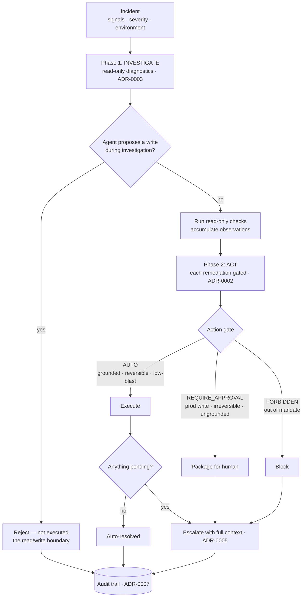

# Architecture

> Downstream of the [decisions](../decisions) by design. Each component links back
> to the ADR that justifies it. Start with the [README](../README.md); this is the
> evidence underneath it. Reference design — the patterns reflect a LangGraph
> multi-agent on-call system I ran in production (~50% manual toil reduction).

## The stance

The agent is allowed to touch production during incidents. The entire architecture
is organised around one boundary: **the agent investigates freely and acts only
through a gate**, where every action is judged by what it can break and where —
never by how confident the model is. Investigation autonomy is cheap and safe;
action autonomy is expensive and supervised, and the two are kept in separate
phases so one can't become the other by accident.

## Incident flow

## Components

| Component | File | Role | Decision |
|-----------|------|------|----------|
| Incident model | [`src/incident.py`](../src/incident.py) | Incident, action, observation, phases, environment | — |
| Action gate | [`src/action_gate.py`](../src/action_gate.py) | AUTO / REQUIRE_APPROVAL / FORBIDDEN by blast radius + environment | [ADR-0002](../decisions/0002-bounded-autonomy.md) |
| Runbook | [`src/runbook.py`](../src/runbook.py) | Symptom → checks + remediation; the grounding source | [ADR-0004](../decisions/0004-grounded-action.md) |
| Agent | [`src/agent.py`](../src/agent.py) | `investigate` / `remediate` interface; deterministic runbook agent; env stub | — |
| Orchestrator | [`src/orchestrator.py`](../src/orchestrator.py) | The gated two-phase loop + escalation builder | [ADR-0003](../decisions/0003-diagnose-then-act.md), [ADR-0005](../decisions/0005-escalation.md) |

The most load-bearing behaviour is the **phase boundary** in `Orchestrator.run`: a
write proposed during the investigation phase is rejected, never executed — and a
test fails if that ever changes. That single rule is ADR-0003 expressed as code,
and it's the line that keeps "the agent can read production" from becoming "the
agent can change production."

## Why two verdicts that look similar are different

`REQUIRE_APPROVAL` and `FORBIDDEN` are deliberately distinct. `REQUIRE_APPROVAL`
means *a human can authorize this* — a prod restart, an irreversible failover, an
ungrounded action. `FORBIDDEN` means *the agent must never do this and a human
shouldn't reach for it through the agent* — deleting data, modifying IAM. The first
escalates with a recommendation; the second escalates as a flag that the runbook
proposed something out of mandate.

## Failure modes

| Situation | Behaviour |
|-----------|-----------|
| Agent tries to write during investigation | Rejected at the phase boundary, not executed ([ADR-0003](../decisions/0003-diagnose-then-act.md)) |
| Remediation has no runbook behind it | `REQUIRE_APPROVAL` — escalated, never auto-run ([ADR-0004](../decisions/0004-grounded-action.md)) |
| Reversible write on production | `REQUIRE_APPROVAL` — a human's name goes on it ([ADR-0002](../decisions/0002-bounded-autonomy.md)) |
| Out-of-mandate action (even if a runbook suggests it) | `FORBIDDEN` — blocked and escalated |
| No runbook for the incident class | Escalate with whatever was observed — never guess ([ADR-0005](../decisions/0005-escalation.md)) |
| Diagnosed but no automated fix exists | Escalate with the investigation context |

## Technology choices and the buy boundary

| Layer | Choice | Build / Buy |
|-------|--------|-------------|
| Alerting / paging | PagerDuty / Opsgenie | **Buy** ([ADR-0008](../decisions/0008-build-vs-buy.md)) |
| Observability (logs, metrics, traces) | Datadog / Grafana | **Buy** |
| Runbook & incident knowledge | Vector store + docs | **Buy / managed** |
| LLM access | Gateway | **Buy** |
| Two-phase gated orchestrator | Custom | **Build** |
| Action policy / gate | Custom | **Build** |
| Eval harness + safety invariants | Custom | **Build** |

The built layers sit above the vendor tools and stay vendor-agnostic, so the
plumbing can change without touching the layer that decides what the agent may do
to production — the portability guardrail from ADR-0008.

---

*Reference architecture for a design by Praveen Kumar. The load-bearing content is
the mapping from each component back to the decision that justifies it.*
